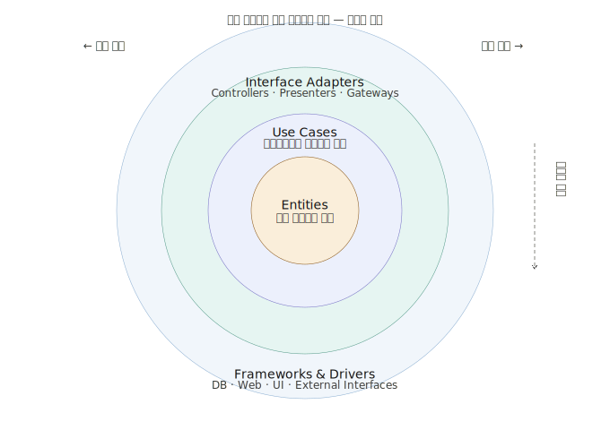
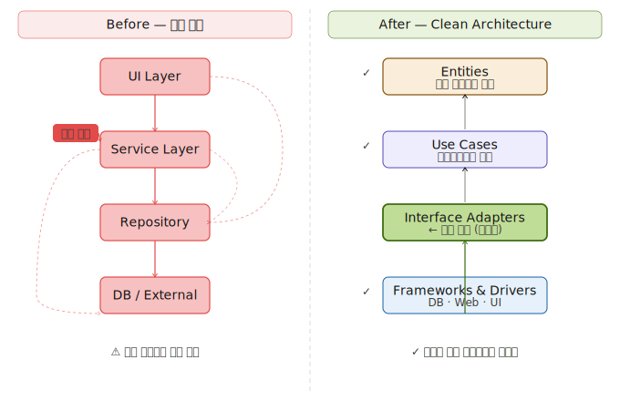
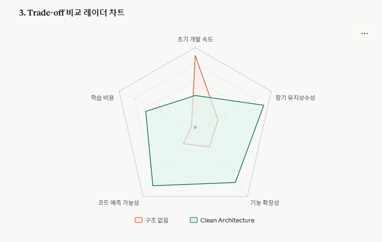

# 3.1 아키텍처 도입 이유 (Clean Architecture)

아키텍처를 설계하기에 앞서, 시스템이 장기적으로 유지되어야 하는 구조인지에 대한 고민이 선행되어야 한다.

- 변경에 유연한 구조인가
- 어떤 요소를 분리하고 어떤 요소를 통합해야 유지보수성이 향상되는가
- 관심사를 어떤 기준으로 분리할 것인가
- 핵심 비즈니스 로직을 왜 보호해야 하며 어떤 방식으로 보호할 것인가
- 추가적인 기능 확장 시 기존 구조를 어떻게 유지할 것인가

위와 같은 요소들은 아키텍처 설계 과정에서 반드시 고려되어야 한다.

하지만 모든 이점을 동시에 만족시키는 구조는 존재하지 않는다.  
프로젝트마다 우선적으로 고려해야 하는 가치가 다르기 때문이다.

어떤 프로젝트는 빠른 개발 속도를 우선해야 하며,  
어떤 프로젝트는 장기적인 유지보수성과 확장성을 우선해야 한다.

또한 단순히 동작하는 코드보다, 동작 흐름을 예측할 수 있는 구조를 더 중요하게 판단하는 경우도 존재한다.

본 프로젝트는 유지보수성과 확장성, 그리고 예측 가능한 코드 구조를 주요 가치로 설정하였다.

기능이 어느 계층에 위치해야 하는지에 대한 기준이 없다면 개발자마다 구현 방식이 달라질 수 있으며 코드 흐름을 이해하는 데 많은 시간이 필요할 수 있다.

이를 위해 Clean Architecture를 도입하여 핵심 비즈니스 로직을 외부 기술 요소로부터 보호하고, 변경 영향 범위를 제어할 수 있는 구조를 구성하고자 하였다.

## Clean Architecture 선택 이유

본 프로젝트에서 Clean Architecture를 선택한 핵심 이유는 다음과 같다.

- 의존성 방향에 대한 규칙이 명확하다.
- 제어의 역전을 통해 외부 기술 변화의 영향을 최소화할 수 있다.
- 핵심 비즈니스 로직을 독립적으로 유지할 수 있다.
- 계층 간 책임을 명확하게 분리할 수 있다.

여러 명의 개발자가 동시에 작업하는 환경에서는 역할, 책임과 명확한 구조가 협업 효율에도 영향을 준다고 생각된다.
의존성 방향의 정의, 계층별 구성 요소, 의존성 역전 원칙에 대한 구체적인 내용은 이후 장에서 다룬다.

## 구조 도입을 통해 기대하는 효과

이 구조가 실질적으로 제공하는 장점은 다음과 같다.

- 수정 시 영향 범위를 구조적으로 예측할 수 있다.
- 외부 기술이 변경되더라도 핵심 로직의 수정 범위를 최소화할 수 있다.
- 새로운 기능 추가 시 책임과 구현 위치를 명확하게 판단할 수 있다.
- 계층 간 역할이 분리되어 유지보수성이 향상된다.

DB 구조 변경이나 외부 API 변경이 발생하더라도,
핵심 비즈니스 로직까지 함께 수정되는 상황을 줄이고 프로젝트 진행 과정에서는 기능 변경과 추가 가능성이 항상 존재 하기 때문에 특정 기능 수정 시 전체 코드에 영향을 주지 않는 구조가 필요하다고 판단된다.

## 구조 적용에 따른 Trade-off

반면, 이러한 구조가 항상 유리한 것은 아니다.

- 초기 설계 비용이 증가할 수 있다.
- 단순한 기능에도 여러 계층을 거쳐야 하는 구조적 복잡성이 발생할 수 있다.
- 추상화 계층이 많아질수록 코드 흐름 파악이 어려워질 수 있다.
- 작은 규모의 프로젝트에서는 과도한 설계가 될 수 있다.

## 구조를 선택한 이유

그럼에도 불구하고 본 프로젝트는 해당 구조를 선택하였다.

구조 없이 개발이 진행될 경우 다음과 같은 문제가 발생할 수 있기 때문이다.

- 하나의 기능을 수정했을 때 직접 관련 없는 여러 영역까지 함께 수정해야 하는 상황이 발생할 수 있다.
- 하나의 클래스가 여러 역할을 동시에 처리하게 되면 코드의 목적과 책임이 불분명해질 수 있다.
- 코드를 수정하거나 새로운 기능을 추가할 때 기존 구조를 이해하는 데 많은 시간이 필요할 수 있다.
- 유지보수 비용과 변경 비용이 지속적으로 증가할 수 있다.

프로젝트가 장기적으로 확장되고 변경될 가능성을 고려했을 때, 명확한 구조가 제공하는 유지보수성과 안정성이 초기 설계 비용보다 더 큰 가치를 가진다고 판단하였다.
