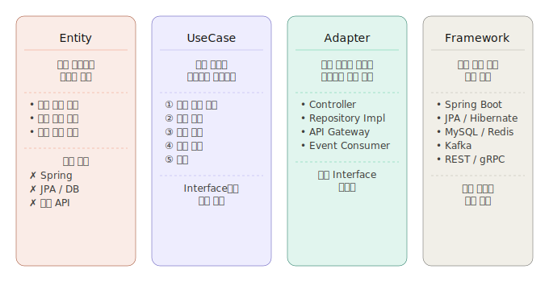

# 3.4 계층 구조

본 프로젝트는 앞 장에서 설명한 의존성 규칙을 기반으로, 핵심 비즈니스 규칙과 실행 흐름을 분리하여 계층을 구성한다. 핵심 비즈니스 규칙과 기술적 요소가 하나의 계층에 혼합될 경우, 외부 기술 변경이 핵심 로직 수정으로 이어지고 변경 영향 범위를 예측하기 어려워진다.

아래 그림은 각 계층의 역할과 책임을 나타낸다.



---

## 3.4.1 Entity

Entity는 시스템의 핵심 비즈니스 규칙과 상태를 관리하는 계층이다. 단순한 데이터 저장 객체가 아니라, 화면 · DB · API와 무관하게 항상 지켜져야 하는 정책을 Entity 내부에 위치시킨다. 이를 통해 핵심 비즈니스 로직이 여러 계층에 분산되지 않도록 구성한다.

### 상태와 행위의 캡슐화

Entity는 상태(State)와 행위(Behavior)를 함께 가진다. 외부 계층이 Entity의 상태를 직접 해석하여 비즈니스 규칙을 판단하게 되면, 동일한 규칙이 여러 UseCase에 중복될 가능성이 높아진다. 규칙이 변경될 때 관련된 모든 코드를 함께 수정해야 하는 문제가 발생한다.


이를 방지하기 위해 Entity 스스로 자신의 상태를 판단하고 처리하도록 구성한다. 외부 계층은 행위만 요청하고, 실제 규칙 검증은 Entity 내부에서 수행한다. 이를 통해 비즈니스 규칙의 중복과 결합도를 줄이고, 핵심 정책을 하나의 계층에서 일관되게 관리할 수 있도록 한다.

### 기술의 독립성

Entity는 핵심 비즈니스 규칙이 위치하는 계층이므로, Spring · JPA · DB · 외부 API 등 특정 기술 요소에 의존하지 않도록 구성한다. 핵심 로직이 기술에 종속되면 기술 변경 시 비즈니스 규칙까지 함께 수정해야 하기 때문이다.

따라서 Entity를 기술적으로 독립된 구조로 유지함으로써, 외부 기술 변화로부터 핵심 비즈니스 규칙을 보호한다.

아래는 핵심 비즈니스 규칙을 중심으로 Entity를 구성한 예시 패키지 구조이다.

```
domain
 └── order
      ├── entity                 // 핵심 도메인 객체
      │    ├── Order             // 주문 정보
      │    ├── OrderItem         // 주문 상품
      │    ├── Payment           // 결제 정보
      │    └── Delivery          // 배송 정보
      │
      ├── policy                 // 비즈니스 정책 및 규칙
      │    ├── CancelPolicy      // 주문 취소 정책
      │    ├── RefundPolicy      // 환불 정책
      │    └── DiscountPolicy    // 할인 정책
      │
      ├── status                 // 상태 값 관리
      │    ├── OrderStatus       // 주문 상태
      │    ├── PaymentStatus     // 결제 상태
      │    └── DeliveryStatus    // 배송 상태
      │
      ├── exception              // 도메인 예외 처리
      │    ├── InvalidOrderException
      │    ├── OutOfStockException
      │    └── AlreadyShippedException
      │
      └── service                // 도메인 규칙 계산 및 검증
           ├── OrderValidator
           └── PaymentCalculator
```

---

## 3.4.2 UseCase

UseCase의 핵심 역할은 orchestration이다.

즉, 여러 Entity와 Repository, 외부 시스템을 조합하여 하나의 비즈니스 시나리오를 완성하는 역할을 수행한다.

이 과정에서 UseCase는 비즈니스 흐름에 따라 각 계층의 기능을 호출하고, 트랜잭션 경계를 관리하며, 저장이나 메시징과 같은 외부 작업을 조율한다.

이를 통해 핵심 비즈니스 규칙(Entity)과 실제 실행 흐름(UseCase)의 책임을 분리하고, 각 계층이 자신의 역할에만 집중할 수 있도록 한다.


위 흐름과 같이 단일 Entity만으로 처리하기 어려운 실행 순서를 UseCase 계층에서 제어한다.

### Entity와 UseCase의 책임 분리

아래는 사용자 시나리오와 실행 흐름을 기준으로 UseCase를 구성한 예시 패키지 구조이다.

```
usecase
 └── order
      ├── command                // 사용자 요청 데이터
      │    ├── CreateOrderCommand
      │    ├── CancelOrderCommand
      │    └── PayOrderCommand
      │
      ├── service                // 비즈니스 실행 흐름 처리
      │    ├── CreateOrderUseCase
      │    ├── CancelOrderUseCase
      │    └── PayOrderUseCase
      │
      ├── dto                    // 실행 결과 반환 객체
      │    ├── OrderResult
      │    └── PaymentResult
      │
      └── port                   // 외부 계층과의 추상화 인터페이스
           ├── OrderRepository
           └── PaymentGateway
```

두 계층은 서로 다른 변경 이유를 가진다.

예를 들어 주문 취소 정책 변경은 Entity의 수정으로 이어질 수 있지만, 결제 프로세스 변경은 UseCase의 실행 흐름 수정으로 이어질 수 있다.

따라서 Entity는 핵심 비즈니스 규칙을, UseCase는 실행 순서를 담당하도록 책임을 분리한다. 이를 통해 변경 영향 범위를 최소화하고, 각 계층이 자신의 역할에만 집중할 수 있는 구조를 구성한다.

### 외부 계층과의 협력


UseCase는 DB나 외부 API의 구현체를 직접 참조하지 않고, 의존성 역전 원칙을 적용하여 추상화된 Interface에만 의존하도록 구성한다.

이를 통해 핵심 비즈니스 흐름을 기술적 요소로부터 분리하고, 유지보수성과 확장성을 확보할 수 있도록 한다.
