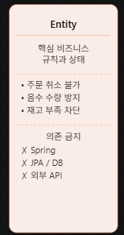
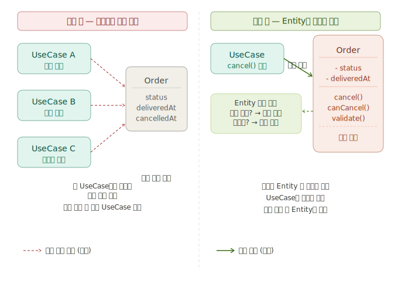
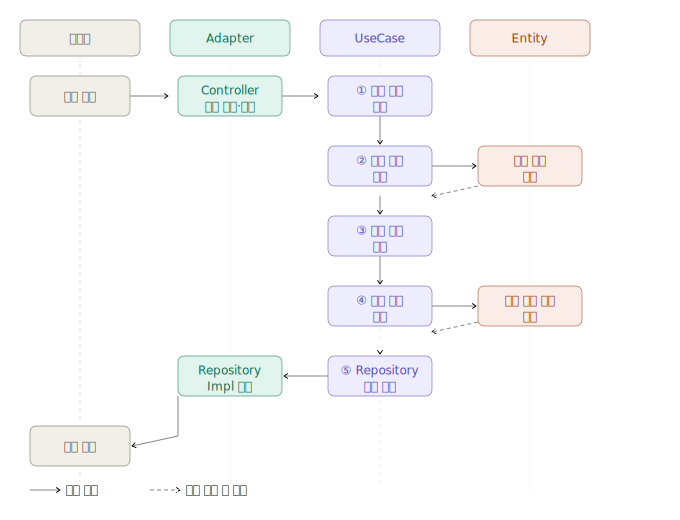
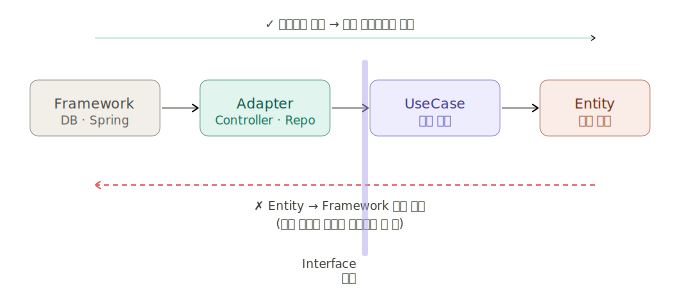

앞 장에서 설명한 의존성 규칙을 기반으로 본 프로젝트는 Inner인 Entity와 Usecase 계층과 outer인 adopter flamework로 구분하여 구조와 역할 을 서술한다.

핵심비즈니스 규칙과 기술적 요소가 하나의 계층에 혼합될 경우 외부 기술 변경이 핵심 로직 수정으로 이어질 가능성이 높아진다. 또한 각 계층의 책임이 불명확해지며, 기능 변경 시 영향 범위를 예측하기 어려워진다.

이를 방지하기 위해 본 프로젝트는 핵심 비즈니스 규칙과 실행 흐름을 분리하였다.

-Entity는 핵심 비즈니스 규칙과 상태를 담당한다.
-UseCase는 사용자 요청에 대한 실행 흐름과 시나리오를 담당한다.
-Adapter는 외부 요청을 내부 계층이 처리할 수 있는 형태로 변환하고 연결하는 역할을 담당한다.
-Framework는 DB, 메시지 브로커, 외부 API 등 실제 기술 요소를 담당하는 영역이다.

3.4.1 Entity

Entity는 시스템의 핵심 비즈니스 규칙을 표현하는 계층이다.

단순히 데이터를 저장하기 위한 객체가 아니라 비즈니스적으로 반드시 지켜져야 하는 규칙과 상태를 함께 관리한다.

이러한 규칙은 화면, DB, API와 관계없이 항상 유지되어야 하는 핵심 정책이다.

따라서 본 프로젝트에서는 이러한 규칙을 Entity 내부에 위치시켜, 핵심 비즈니스 로직이 여러 계층에 분산되지 않도록 구성하였다.

Entity에서 중요한 개념으로는 상태와 행위의 캡슐화와 기술의 독립성이라고 할 수 있다.
상태와 행위의 캡슐화는 Entity는 상태(State)와 행위(Behavior)를 함께 가진다.

외부 계층이 Entity의 상태를 직접 해석하여 비즈니스 규칙을 판단하게 되면, 동일한 규칙이 여러 계층에 중복될 가능성이 높아진다.
예를 들어 주문 취소가능 여부를 여러 UseCase에서 각각 판단하게 되면, 규칙 변경 시 모든 코드를 함께 수정해야 하는 상황이 발생할 수 있다.

이를 방지하기 위해 Entity 스스로 자신의 상태를 판단하고 처리하도록 구성한다.

즉, 외부 계층은 단순히 행위를 요청하고, 실제 규칙 검증은 Entity 내부에서 수행한다.

이를 통해 비즈니스 규칙의 중복과 결합도를 줄이고, 핵심 정책 하나의 계층에서 일관되게 관리할 수 있도록 하였다.

또 기술의 독립성은 Entity는 핵심 비즈니스 규칙이 위치하는 계층이므로, 특정 기술 요소에 의존하지 않도록 구성하였다.

핵심 비즈니스 로직이 기술 요소에 종속될 경우, 기술 변경시 핵심 로직까지 함께 수정될 가능성이 높아지기 때문이다.

클린아키텍처에서는 Entity를 기술적으로 독립된 구조로 유지함으로써, 외부 기술 변화로부터 핵심 비즈니스 규칙을 보호하고자 하였다.

3.4.2 UseCase

UseCase는 사용자 요청을 처리하기 위한 실행 흐름을 담당하는 계층이다.

Entity가 핵심 비즈니스 규칙 자체를 표현한다면, UseCase는 여러 Entity와 Repository를 조합하여 실제 비즈니스 시나리오를 수행한다.

이러한 흐름은 단일 Entity만으로 처리하기 어렵기 때문에, UseCase 계층에서 전체 실행 순서를 제어한다.

Entity와 UseCase의 책임 분리

핵심 비즈니스 규칙과 실행 흐름은 서로 다른 변경 이유를 가진다.

예를 들어 주문 취소 정책 변경은 Entity의 수정으로 이어질 수 있지만, 결제 프로세스 변경은 UseCase의 실행 흐름 수정으로 이어질 수 있다.

따라서 본 프로젝트는 규칙과 흐름의 책임을 분리하여 변경 영향 범위를 최소화하고자 하였다.

Entity는 핵심 규칙을 담당한다.
UseCase는 실행 순서를 담당한다.

이를 통해 각 계층이 자신의 역할에만 집중할 수 있는 구조를 구성하였다.

의존성 역전 원칙을 적용하여 UseCase는 추상화된 Interface에 의존하도록 구성하였다.

결과적으로 핵심 비즈니스 흐름을 기술적 요소로부터 분리하고, 유지보수성과 확장성을 확보할 수 있도록 설계하였다.
